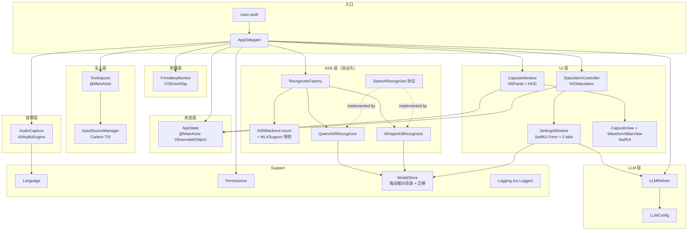
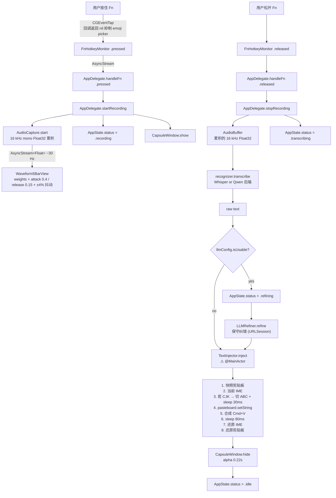
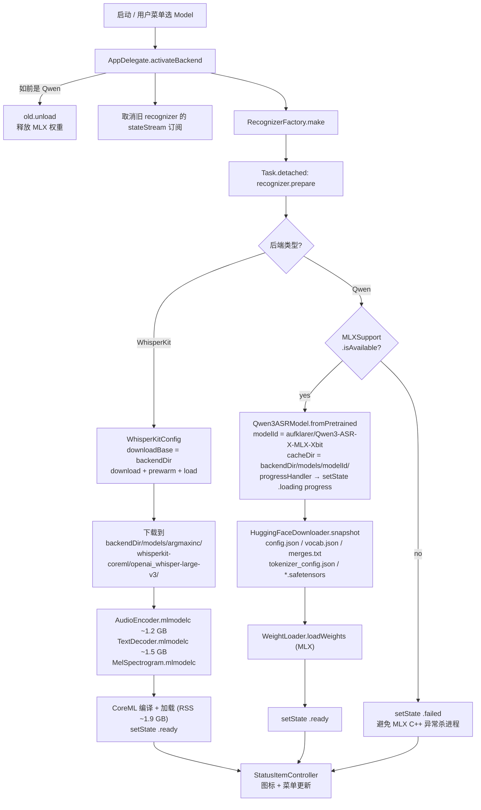
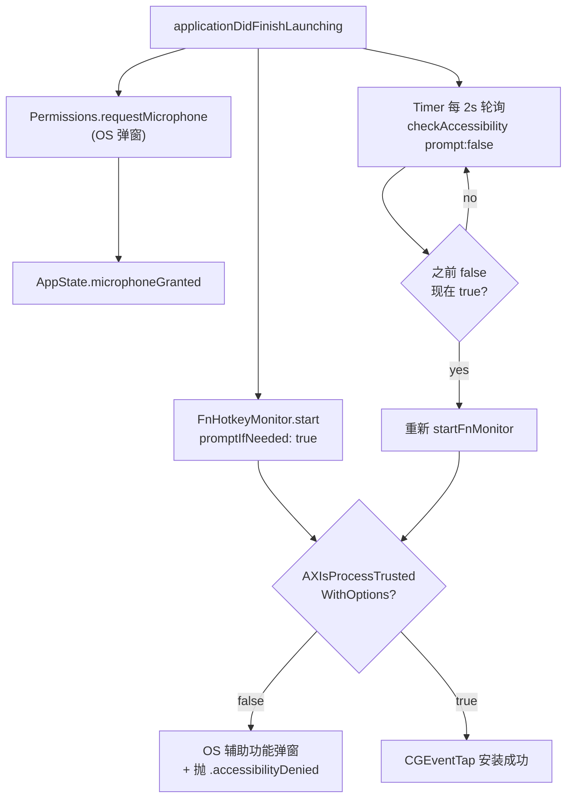

# VoiceTyping 架构

> 截至 v0.2.0。本文档跟随代码同步更新，发现不一致以代码为准。

## 1. 概览

VoiceTyping 是一个 macOS 菜单栏语音输入工具：按住 Fn 录音，松开后将转录文本通过剪贴板 + Cmd+V 注入到当前焦点输入框。默认中文（zh-CN），支持五种语言切换；可选 LLM 后处理纠正中英混杂的识别错误。

**运行模式**：LSUIElement（仅菜单栏图标，无 Dock 图标）。
**目标平台**：macOS 15+，Apple Silicon (arm64)（MLX Swift 要求）。
**构建**：Swift Package Manager (tools 6.0) + Makefile。

## 2. 技术栈

| 层 | 技术 | 备注 |
|---|---|---|
| UI | AppKit + SwiftUI（NSHostingView 桥接） | 菜单栏走 AppKit，胶囊走 SwiftUI |
| 全局热键 | CGEventTap (Quartz) | 监听 `kCGEventFlagsChanged` 检测 Fn |
| 音频 | AVAudioEngine | 采集 → 16 kHz mono float32 |
| 语音识别 | `SpeechRecognizer` 协议 + 2 个实现 | 详见 §5.1；运行时切换 |
| ASR backend A | WhisperKit 0.9+ (CoreML) | `openai_whisper-large-v3`，~3 GB |
| ASR backend B | `soniqo/speech-swift` 0.0.9+ (MLX) | `Qwen3-ASR 0.6B/1.7B`，~400 MB / ~1.4 GB |
| LLM | URLSession + OpenAI 兼容 chat completions | 可选 |
| 输入法切换 | Carbon TextInputServices (TIS) | CJK IME 检测与临时切换 |
| 文本注入 | NSPasteboard + 合成 Cmd+V (CGEvent) | |
| 持久化 | UserDefaults | 语言偏好、LLM 配置、当前后端 |

## 3. 模块地图

### 3.1 模块依赖图



### 3.2 文件职责

每个文件的职责（src 路径相对 `Sources/VoiceTyping/`）：

```
main.swift                     入口；MainActor.assumeIsolated 启动 NSApplication
AppDelegate.swift              生命周期 + 管线编排（Fn → 录音 → 转录 → refine → 注入）
AppState.swift                 @MainActor ObservableObject，UI/逻辑共享状态
Support/
  Language.swift               5 语言 enum + Whisper ISO 码 + Qwen 英文单词映射
  Permissions.swift            麦克风 + 辅助功能权限查询/请求/跳转设置
  ModelStore.swift             按后端分目录 + isDownloaded/sizeOnDisk/delete + v0.1.0 迁移
  Logging.swift                os.Logger（subsystem = com.voicetyping.app）
Audio/
  AudioCapture.swift           AVAudioEngine 采集 + 实时 RMS 流 + 16 kHz 重采样累积
ASR/
  SpeechRecognizer.swift       协议：prepare/transcribe/cancel + 类型 (AudioBuffer, RecognizerState)
  ASRBackend.swift             三档后端 enum + MLXSupport 预检 + default 选择策略
  RecognizerFactory.swift      根据 ASRBackend 构造对应 recognizer
  WhisperKitRecognizer.swift   WhisperKit 实现
  QwenASRRecognizer.swift      MLX (soniqo/speech-swift) 实现 + OSAllocatedUnfairLock 串行化
Hotkey/
  FnHotkeyMonitor.swift        CGEventTap 监听 Fn flagsChanged，回调返回 nil 抑制 emoji 选择器
Inject/
  InputSourceManager.swift     TIS 查询当前 IME / 切换到 ABC / 还原
  TextInjector.swift           @MainActor，剪贴板快照 + IME 切换 + Cmd+V + 还原
LLM/
  LLMConfig.swift              Codable 配置 + UserDefaults 存取
  LLMRefiner.swift             OpenAI 兼容请求 + 保守纠错 system prompt + 失败回落
UI/
  CapsuleWindow.swift          NSPanel (nonactivatingPanel) + NSVisualEffectView (.hudWindow)
  CapsuleView.swift            SwiftUI 胶囊内容（HStack: 波形 + 文字）+ 尺寸 PreferenceKey
  Waveform5BarView.swift       5 根 RMS 驱动的波形条（attack/release 包络 + 抖动 + 权重）
Menu/
  StatusItemController.swift   NSStatusItem + 动态 NSMenu，订阅 AppState 变化
  SettingsWindow.swift         NSWindow + SwiftUI Form：API Base URL / Key / Model / Test / Save
```

## 4. 关键数据流

### 4.1 录音→注入主管线



### 4.2 模型加载流



路径：`backendDir = ~/Library/Application Support/VoiceTyping/models/<storageDirName>/`，`storageDirName ∈ { whisperkit, qwen-asr-0.6b, qwen-asr-1.7b }`。

切换后端时 `AppDelegate.activateBackend` 会取消前一个 recognizer 的 state 订阅并新订阅新的；前一个 Qwen 的 MLX 权重会被 `unload()` 释放；老的模型文件保留在磁盘（下次切回零等待）。

### 4.3 权限流



## 5. 关键设计决策

### 5.1 ASR 协议化（核心可扩展点）

`SpeechRecognizer` 是一个简单协议（`prepare` / `transcribe` / `cancel` + 状态流）。已有两个实现（`WhisperKitRecognizer`、`QwenASRRecognizer`），新增后端只要实现这三个方法 + 在 `ASRBackend` enum 加一个 case + 在 `RecognizerFactory.make` 加一个分支。菜单 / 设置 / 持久化无需改动。

协议派发的开销在 Swift 中是亚微秒级，相对 ASR 本身的秒级耗时完全可忽略。详见 [`SpeechRecognizer.swift`](../Sources/VoiceTyping/ASR/SpeechRecognizer.swift)。

`ASRBackend` 在 `default` 时做 `MLXSupport.isAvailable` 预检：如果 app bundle 里没 `mlx.metallib`（没跑 `make setup-metal`），默认降级到 Whisper large-v3，保证 app 不会开机就崩。用户仍可从菜单手动选 Qwen，但此时 prepare 会提前返回 `.failed` 而不碰 MLX。详见 [`ASRBackend.swift`](../Sources/VoiceTyping/ASR/ASRBackend.swift)。

### 5.2 Fn 抑制

按 Fn 的默认 OS 行为（在 `系统设置 → 键盘 → 按下 fn/🌐 键时`）通常是触发 emoji & symbols 选择器。要按住 Fn 录音又不弹 emoji，必须**在用户层面阻止事件传播**：

- `CGEvent.tapCreate(tap: .cgSessionEventTap, place: .headInsertEventTap, options: .defaultTap)` — 关键点是 `.defaultTap`（非 `.listenOnly`），允许回调修改/丢弃事件
- 回调中检测 `.maskSecondaryFn` 翻转，**返回 `nil` 而不是 `Unmanaged.passUnretained(event)`**，这就吞掉了事件
- 非 Fn 的 flag changes（Shift/Ctrl/Cmd…）必须照常透传

### 5.3 IME 感知注入

中文/日文/韩文输入法（拼音、Pinyin、Japanese、Hangul 等）在激活状态下会拦截 Cmd+V 把它当成自己的输入候选确认快捷键，导致粘贴失败或行为异常。

`TextInjector.inject` 流程：

1. 通过 `TISGetInputSourceProperty(src, kTISPropertyInputSourceLanguages)` 获取当前输入源的语言数组
2. 同时检查 source ID 关键字（`Pinyin`, `Japanese`, `Hangul`...）排除"语言为中文但实质是 ABC 键盘布局"的情况
3. 是 CJK IME → 切到 `com.apple.keylayout.ABC`，sleep 30 ms 等切换生效
4. 完成粘贴后还原原 IME

### 5.4 LLM 保守纠错

system prompt 强制 LLM **只**修复明显的语音识别错误（"配森"→"Python"），**不**改写、润色、翻译、删减。如果原文已正确 → 原样返回。详见 [`LLMRefiner.swift`](../Sources/VoiceTyping/LLM/LLMRefiner.swift) 中的 `systemPrompt` 字段。

LLM 失败永远 **fallback 到原始转录**，不会让用户失去文本。

### 5.5 实时 RMS 波形

5 根条由真实音频电平驱动（不是假动画）：

- AudioCapture 在 AVAudioEngine tap callback 中计算 RMS（仅 channel 0、原生采样率）→ 映射到 dB → 归一化到 0..1
- 通过 `AsyncStream<Float>` ~30 Hz 推送给 Waveform5BarView
- 每个 frame 应用包络（attack 0.4 / release 0.15）+ 权重 `[0.5, 0.8, 1.0, 0.75, 0.55]` + 每条 ±4% 随机抖动

参数化在 [`Waveform5BarView.swift`](../Sources/VoiceTyping/UI/Waveform5BarView.swift) 顶部常量。

### 5.6 胶囊视觉

- `NSPanel` (`.nonactivatingPanel`)：不抢焦点，不进入 `Cmd+Tab` 列表
- `level = .statusBar`：浮在所有普通窗口之上
- `collectionBehavior = [.canJoinAllSpaces, .fullScreenAuxiliary, .stationary]`：跟随空间切换、全屏可见
- `NSVisualEffectView(.hudWindow, .behindWindow, .active)` 提供模糊背景
- **形状蒙版用 `maskImage`（9-slice 可拉伸的圆角图）而不是 `layer.cornerRadius`**：`.hudWindow` 材质对图层圆角支持不干净，会有边缘漏色（v0.1.0 修过这个 bug）
- 宽度自适应：SwiftUI 内部用 PreferenceKey 上报实测尺寸，CapsuleWindow 用 `NSAnimationContext` 平滑动画到新尺寸（spring 0.25 s）
- 入场 0.35 s alpha fade-in，退场 0.22 s alpha fade-out

## 6. 并发与线程模型

主要的 isolation 策略：

| 类型 | Isolation | 原因 |
|---|---|---|
| `AppDelegate` | `@MainActor` | UI 编排、状态变更必须在主线程 |
| `AppState` | `@MainActor` | `@Published` 在主线程更新 SwiftUI/Combine 订阅者 |
| `StatusItemController` | `@MainActor` | NSStatusItem / NSMenu 仅主线程 |
| `TextInjector` | `@MainActor` ⚠️ | TIS API 用 `dispatch_assert_queue` 强制要求主队列；CGEvent.post 也是主线程敏感 |
| `CapsuleWindow` | `@MainActor`（隐式继承） | NSWindow API |
| `WhisperKitRecognizer` | non-isolated, `@unchecked Sendable` | 后台运行 ASR；内部 lock 保护状态 |
| `QwenASRRecognizer` | non-isolated, `@unchecked Sendable` | Qwen3ASRModel 本身不是 Sendable 且 `transcribe()` 是同步阻塞调用；我们用 `OSAllocatedUnfairLock` 串行化 + 在 `Task.detached` 跑，避免阻塞调用方 |
| `InputSourceManager` | `@unchecked Sendable` | 只在 `TextInjector`（主线程）调用，Carbon TIS API 隐含主线程 |
| `AudioCapture` | non-isolated, `@unchecked Sendable` | tap callback 在 AVAudioEngine 内部线程；用 `NSLock` 保护累积 buffer |
| `FnHotkeyMonitor` | non-isolated, `@unchecked Sendable` | tap callback 在 CFRunLoop 主线程，但通过 AsyncStream 解耦给消费者 |
| `LLMRefiner` | non-isolated, `Sendable` | 无状态 URLSession 封装，跨 actor 安全传递 |

**关键陷阱**：Carbon TIS API（`TISCopyCurrentKeyboardInputSource`、`TISSelectInputSource`）会在非主队列调用时直接 SIGTRAP。详见 devlog v0.1.0 的崩溃修复。

## 7. 持久化

- 语言偏好：`UserDefaults.standard["language"]` 存 raw value（"en" / "zh-CN" 等）。AppState 在 `didSet` 中写入。
- LLM 配置：`UserDefaults.standard["llmConfig"]` 存 JSON 序列化的 `LLMConfig`。同样在 `didSet` 中持久化。
- ASR 后端偏好：`UserDefaults.standard["asrBackend"]` 存 raw value（"whisper-large-v3" / "qwen-asr-0.6b" / "qwen-asr-1.7b"）。`AppState` init 时若发现 persisted 是 Qwen 但 MLX 不可用，自动降级到 `.default`（Whisper）。
- 模型缓存：`~/Library/Application Support/VoiceTyping/models/<backend-dir>/`：
  - `whisperkit/models/argmaxinc/whisperkit-coreml/openai_whisper-large-v3/`（WhisperKit 自己会在 `downloadBase` 内加一层 `models/`）
  - `qwen-asr-0.6b/models/aufklarer/Qwen3-ASR-0.6B-MLX-4bit/`
  - `qwen-asr-1.7b/models/aufklarer/Qwen3-ASR-1.7B-MLX-8bit/`
- v0.1.0 → v0.2.0 迁移：启动时若发现 `<modelsURL>/models/`（v0.1.0 平铺路径）存在而 `<modelsURL>/whisperkit/models/` 不存在，整体 `mv` 过去。详见 [`ModelStore.migrateV010WhisperLayoutIfNeeded`](../Sources/VoiceTyping/Support/ModelStore.swift)。

## 8. 权限模型

| 权限 | 何时请求 | 何时检查 |
|---|---|---|
| Microphone | 启动时 `AVCaptureDevice.requestAccess(for: .audio)`（OS 弹窗） | `AVCaptureDevice.authorizationStatus(for: .audio)` |
| Accessibility | 启动时 `AXIsProcessTrustedWithOptions(prompt: true)`；用户拒后通过菜单"Grant…"重新引导到 System Settings | 每 2 s 轮询 + 菜单展开时刷新 |

权限不足时：菜单顶部出现 "Grant Accessibility Permission…" / "Grant Microphone Permission…" 项，点击跳转到 `x-apple.systempreferences:` 对应面板。

⚠️ ad-hoc codesign 每次重建会改变 cdhash，TCC 把它视为新应用，旧授权会失效。开发期重建后需要重新授权（或 `tccutil reset Accessibility com.voicetyping.app`）。

## 9. 构建与分发

`Makefile` targets：

| target | 作用 |
|---|---|
| `make setup-metal` | **一次性**：`xcodebuild -downloadComponent MetalToolchain`。Qwen (MLX) 后端需要，没装则 app 启动时默认降级到 Whisper |
| `make metallib` | 调 `scripts/build_mlx_metallib.sh` 把 MLX 的 33 个 metal kernel 编译成 `.build/release/mlx.metallib`（~100 MB） |
| `make build` | `metallib` → `swift build -c release --arch arm64` → 复制到 `build/VoiceTyping.app/Contents/{MacOS,Resources}` → 嵌入 `mlx.metallib` → ad-hoc codesign + entitlements |
| `make run` | `make build` 后 `open` 这个 .app |
| `make install` | 将 `build/VoiceTyping.app` 拷到 `/Applications/` |
| `make debug` | 仅 `swift build`（不打包），用于快速 lint |
| `make clean` | `swift package clean` + 删除 `.build` 和 `build` |

签名是 ad-hoc (`codesign --sign -`)，仅本地开发可用。entitlements 包含 `com.apple.security.device.audio-input`。Info.plist 设置 `LSUIElement=YES` 隐藏 Dock 图标。

**MLX metallib 查找顺序**（运行时）：`Contents/MacOS/mlx.metallib` → `Resources/mlx.metallib` → SwiftPM bundle `default.metallib` → `Resources/default.metallib` → 编译时 `METAL_PATH`。我们 `cp` 到 MacOS 目录是因为它最高优先级。

## 10. 已知限制

- 仅支持 Apple Silicon + macOS 15+（MLX Swift 和 `soniqo/speech-swift` 要求）。Intel Mac / Sonoma 留在 v0.1.x。
- 首次加载对应后端需要下载（Whisper ~3 GB / Qwen-1.7B ~1.4 GB / Qwen-0.6B ~400 MB）。
- Metal Toolchain 未装时 Qwen 后端不可用（但 app 不再崩，降级到 Whisper）。
- ad-hoc 签名导致 TCC 授权在重建后失效。
- Fn 监听仅基于 `kCGEventFlagsChanged.maskSecondaryFn`，未处理 NX_SYSDEFINED 系统事件子类型（部分外接键盘可能用此路径）。
- 录音长度安全上限 60 秒（[`AudioCapture.maxDuration`](../Sources/VoiceTyping/Audio/AudioCapture.swift)）。
- WhisperKit 的下载进度是 indeterminate（上游 API 不暴露），只有 Qwen 后端有实时百分比。
