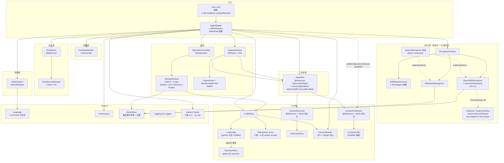
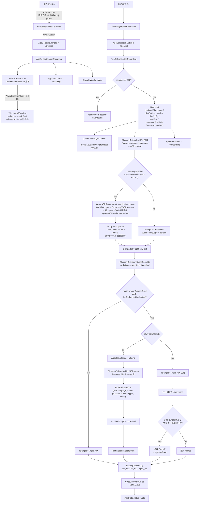
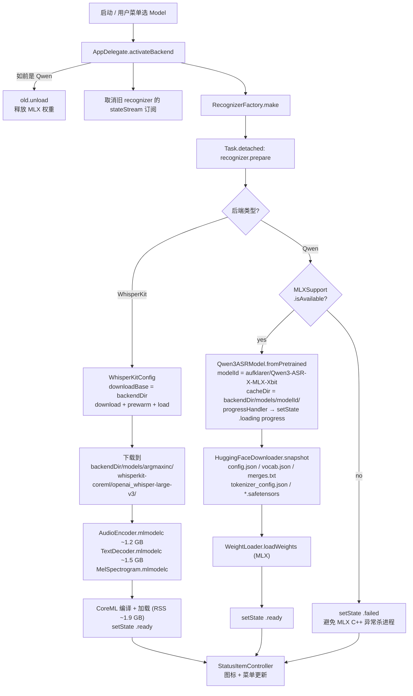
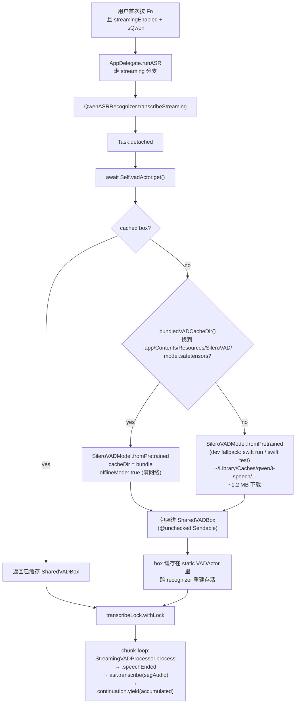
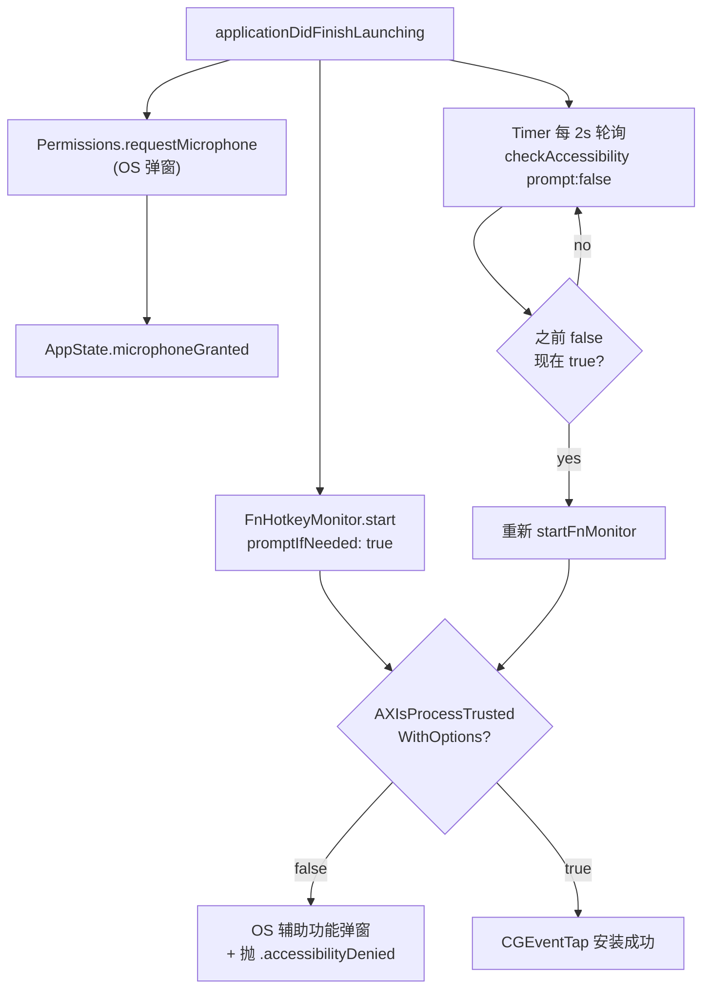

# VoiceTyping 架构

> 截至 v0.4.5。本文档跟随代码同步更新，发现不一致以代码为准。近期里程碑：v0.3.1 per-app 上下文 profile、v0.4.1 API key Keychain 迁移 + 稳定签名 + CI、v0.4.2 流式转录 (opt-in experimental)、v0.4.3 ASR 回归测试台、v0.4.4 Silero VAD bundle 预装 + refine 默认 Off + Developer logging、v0.4.5 VAD 调参 (minSpeech 0.3 / minSilence 0.7) + HallucinationFilter (训练尾巴 + prompt echo)。

## 1. 概览

VoiceTyping 是一个 macOS 菜单栏语音输入工具：按住 Fn 录音，松开后将转录文本通过剪贴板 + Cmd+V 注入到当前焦点输入框。默认中文（zh-CN），支持五种语言切换；可选 LLM 后处理做四档强度可选的清洗与重写；自定义词典双层注入（ASR bias + LLM glossary）+ per-app 上下文 profile 提升术语与专有名词准确率。Qwen3 后端可选 VAD 分段流式（opt-in，胶囊里逐段浮现文字，长录音不受 per-segment token cap 限制）。

**运行模式**：LSUIElement（仅菜单栏图标，无 Dock 图标）。
**目标平台**：macOS 15+，Apple Silicon (arm64)（MLX Swift 要求）。
**构建**：Swift Package Manager (tools 6.0) + Makefile。

## 2. 技术栈

| 层 | 技术 | 备注 |
|---|---|---|
| UI | AppKit + SwiftUI（NSHostingView 桥接） | 菜单栏走 AppKit，胶囊走 SwiftUI |
| 全局热键 | CGEventTap (Quartz) | 监听 `kCGEventFlagsChanged` 检测 Fn |
| 音频 | AVAudioEngine | 采集 → 16 kHz mono float32 |
| 语音识别 | `SpeechRecognizer` 协议 + 2 个实现 | 详见 §5.1；运行时切换 |
| ASR backend A | WhisperKit 0.9+ (CoreML) | `openai_whisper-large-v3`，~3 GB |
| ASR backend B | `soniqo/speech-swift` 0.0.9+ (MLX) | `Qwen3-ASR 0.6B/1.7B`，~400 MB / ~1.4 GB |
| 流式 VAD | `SpeechVAD.SileroVADModel` (MLX, ~1.2 MB) | v0.4.2 opt-in；仅 Qwen backend；`StreamingVADProcessor` 切段后用 Qwen 逐段转。v0.4.4 起权重打进 app bundle (`Contents/Resources/SileroVAD/`)，`offlineMode: true` 零网络加载 |
| LLM | URLSession + OpenAI 兼容 chat completions | 四档强度 `Off / Fix Errors / Clean Up / Polish` (rawValue 仍是 off/conservative/light/aggressive)；v0.4.4 默认翻到 Off |
| 字典 | `CustomDictionary` + JSON 文件 | LRU + debounced flush；双层注入（ASR context + LLM glossary） |
| 上下文 profile | `ContextProfileStore` + JSON 文件 | v0.3.1；按前台 bundle ID 匹配，注入到 refiner system prompt |
| 输入法切换 | Carbon TextInputServices (TIS) | CJK IME 检测与临时切换 |
| 文本注入 | NSPasteboard + 合成 Cmd+V (CGEvent) | 可选 Raw-first：先注 raw，refiner 后台替换 |
| API key 存储 | `KeychainStore` (Security framework) | v0.4.1：`kSecClassGenericPassword`，service = bundle id，`kSecAttrAccessibleWhenUnlocked` |
| 持久化 | UserDefaults + JSON + Keychain | UserDefaults：语言/后端/refineMode/rawFirst/streamingEnabled/LLMConfig(不含 apiKey)；JSON：字典 + profiles；Keychain：apiKey |
| 代码签名 | 自签名证书（稳定 cdhash） | v0.4.1：`make setup-cert` 一次性创建；TCC 授权跨 rebuild 保留 |
| CI | GitHub Actions macos-15 | v0.4.1：`swift build -c debug` smoke 防 Swift 6 regress |

## 3. 模块地图

### 3.1 模块依赖图



### 3.2 文件职责

每个文件的职责（src 路径相对 `Sources/VoiceTyping/`）：

```
main.swift                     入口；先跑 LLMConfigStore.migrateIfNeeded（v0.4.1），再 MainActor.assumeIsolated 启动 NSApplication
AppDelegate.swift              生命周期 + 管线编排（Fn → 录音 → [batch|streaming] → refine → 注入）；NSWorkspace 观察前台 app 变化维护 lastNonSelfFrontmostBundleID
AppState.swift                 @MainActor ObservableObject，UI/逻辑共享状态；streamingEnabled (v0.4.2)、developerMode (v0.4.4)；v0.4.4 移除 capsuleText + tailTruncated (胶囊不再显示转写文本)
Support/
  Language.swift               5 语言 enum + Whisper ISO 码 + Qwen 英文单词映射 + isChinese 分支点
  Permissions.swift            麦克风 + 辅助功能权限查询/请求/跳转设置
  ModelStore.swift             按后端分目录 + isDownloaded/sizeOnDisk/delete + v0.1.0 迁移
  Logging.swift                os.Logger（subsystem = com.voicetyping.app）
  LatencyTracker.swift         ASR/LLM/inject 三段 ms 埋点 → os_log
Audio/
  AudioCapture.swift           AVAudioEngine 采集 + 实时 RMS 流 + 16 kHz 重采样累积
ASR/
  SpeechRecognizer.swift       协议：prepare/transcribe/cancel + 类型 (AudioBuffer, RecognizerState)
  ASRBackend.swift             三档后端 enum + MLXSupport 预检 + default 选择策略；MLXSupport.overrideAvailable 测试钩子
  RecognizerFactory.swift      根据 ASRBackend 构造对应 recognizer
  WhisperKitRecognizer.swift   WhisperKit 实现
  QwenASRRecognizer.swift      MLX (soniqo/speech-swift) 实现 + OSAllocatedUnfairLock 串行化；v0.4.2 额外挂 transcribeStreaming extension + VADActor (actor) + SharedVADBox (@unchecked Sendable) — 自拼 VAD 分段 runner（不走上游 StreamingASR，它的 closure 同步执行给不出 progressive yield）；v0.4.4 增 bundledVADCacheDir() 首选 app bundle 内的 Silero 权重，offlineMode: true 零网络加载
Hotkey/
  FnHotkeyMonitor.swift        CGEventTap 监听 Fn flagsChanged，回调返回 nil 抑制 emoji 选择器
Inject/
  InputSourceManager.swift     TIS 查询当前 IME / 切换到 ABC / 还原
  TextInjector.swift           @MainActor，剪贴板快照 + IME 切换 + Cmd+V + 还原
LLM/
  LLMConfig.swift              Codable 配置 + UserDefaults 存取 + hasCredentials 判断；v0.4.1 起 apiKey 由 CodingKeys 排除，load/save 时从 Keychain 填入/写出；LLMConfigStore.migrateIfNeeded 做 v0.3.x → v0.4.0 一次性迁移 + 失败时暴露 migrationFailure 给 AppDelegate 起告警
  KeychainStore.swift          v0.4.1 新增；Security framework 薄包装；service = com.voicetyping.app，account = openai-api-key，kSecAttrAccessibleWhenUnlocked
  LLMRefiner.swift             OpenAI 兼容请求 + 按 RefineMode 选 system prompt + glossary + profile snippet 拼接 + 失败回落
  RefineMode.swift             4 档枚举 + 3 份 system prompt 常量（off 短路、conservative/light/aggressive = 内部 rawValue；v0.4.4 起 displayName 对外叫 Off / Fix Errors / Clean Up / Polish，默认值 `.off`）
  DictionaryEntry.swift        id / term / hints[] / note / createdAt / lastMatchedAt + hasContent / recency / dedupKey
  CustomDictionary.swift       @MainActor，JSON 持久化，debounced 5s flush，损坏容错，import/export
  GlossaryBuilder.swift        Qwen context / Whisper prompt / LLM glossary 三套 formatter + LRU + 贪心 budget + 命中扫描
  ContextProfile.swift         v0.3.1 新增；ContextProfile { id, name, bundleID, systemPromptSnippet, createdAt, lastUsedAt? } + ContextProfileStore（@MainActor，JSON 持久化，同 CustomDictionary 模式，lookup(bundleID:)）
UI/
  CapsuleWindow.swift          NSPanel (nonactivatingPanel) + NSVisualEffectView (.hudWindow)
  CapsuleView.swift            SwiftUI 胶囊内容（HStack: Morse indicator + 文字）+ 尺寸 PreferenceKey；文字用 AppState.labelTextForCapsule，流式 transcribing 阶段做 head truncation 只显示最后 30 字符
  Waveform5BarView.swift       历史波形条实现（v0.3 起不再在胶囊显示，保留给潜在场景）
Menu/
  StatusItemController.swift   NSStatusItem + 动态 NSMenu，订阅 AppState 变化；Settings 升到顶级 ⌘,
  SettingsWindow.swift         BorderlessKeyWindow + Liquid Glass (macOS 26+) + 5 tab：Models / LLM / Dictionary / Profiles (v0.3.1) / Advanced (v0.4.4)；Models tab 底部挂 Streaming SectionCard (v0.4.2，Whisper 下禁用)；Advanced 里放 Developer logging 开关 + 一键 copy `log stream` 命令
```

## 4. 关键数据流

### 4.1 录音→注入主管线



### 4.2 模型加载流



路径：`backendDir = ~/Library/Application Support/VoiceTyping/models/<storageDirName>/`，`storageDirName ∈ { whisperkit, qwen-asr-0.6b, qwen-asr-1.7b }`。

切换后端时 `AppDelegate.activateBackend` 会取消前一个 recognizer 的 state 订阅并新订阅新的；前一个 Qwen 的 MLX 权重会被 `unload()` 释放；老的模型文件保留在磁盘（下次切回零等待）。

### 4.3 流式 VAD 加载流（v0.4.2；v0.4.4 改为 bundle 优先）



**v0.4.4 打包策略**：Silero 权重 (`model.safetensors` 1.2 MB + `config.json` 384 B) 直接放 `Resources/SileroVAD/`，Makefile `make build` 拷进 `.app/Contents/Resources/SileroVAD/`。运行时 `QwenASRRecognizer.bundledVADCacheDir()` 优先用 bundle 内的权重，`offlineMode: true` 跳过网络。dev 回环 (`swift run` / `swift test` 不走 `make build`) fallback 到 HuggingFace 默认缓存 (`~/Library/Caches/qwen3-speech/models/aufklarer/Silero-VAD-v5-MLX/`)。

### 4.4 权限流



## 5. 关键设计决策

### 5.1 ASR 协议化（核心可扩展点）

`SpeechRecognizer` 是一个简单协议（`prepare` / `transcribe` / `cancel` + 状态流）。已有两个实现（`WhisperKitRecognizer`、`QwenASRRecognizer`），新增后端只要实现这三个方法 + 在 `ASRBackend` enum 加一个 case + 在 `RecognizerFactory.make` 加一个分支。菜单 / 设置 / 持久化无需改动。

协议派发的开销在 Swift 中是亚微秒级，相对 ASR 本身的秒级耗时完全可忽略。详见 [`SpeechRecognizer.swift`](../Sources/VoiceTyping/ASR/SpeechRecognizer.swift)。

`ASRBackend` 在 `default` 时做 `MLXSupport.isAvailable` 预检：如果 app bundle 里没 `mlx.metallib`（没跑 `make setup-metal`），默认降级到 Whisper large-v3，保证 app 不会开机就崩。用户仍可从菜单手动选 Qwen，但此时 prepare 会提前返回 `.failed` 而不碰 MLX。详见 [`ASRBackend.swift`](../Sources/VoiceTyping/ASR/ASRBackend.swift)。

### 5.2 Fn 抑制

按 Fn 的默认 OS 行为（在 `系统设置 → 键盘 → 按下 fn/🌐 键时`）通常是触发 emoji & symbols 选择器。要按住 Fn 录音又不弹 emoji，必须**在用户层面阻止事件传播**：

- `CGEvent.tapCreate(tap: .cgSessionEventTap, place: .headInsertEventTap, options: .defaultTap)` — 关键点是 `.defaultTap`（非 `.listenOnly`），允许回调修改/丢弃事件
- 回调中检测 `.maskSecondaryFn` 翻转，**返回 `nil` 而不是 `Unmanaged.passUnretained(event)`**，这就吞掉了事件
- 非 Fn 的 flag changes（Shift/Ctrl/Cmd…）必须照常透传

### 5.3 IME 感知注入

中文/日文/韩文输入法（拼音、Pinyin、Japanese、Hangul 等）在激活状态下会拦截 Cmd+V 把它当成自己的输入候选确认快捷键，导致粘贴失败或行为异常。

`TextInjector.inject` 流程：

1. 通过 `TISGetInputSourceProperty(src, kTISPropertyInputSourceLanguages)` 获取当前输入源的语言数组
2. 同时检查 source ID 关键字（`Pinyin`, `Japanese`, `Hangul`...）排除"语言为中文但实质是 ABC 键盘布局"的情况
3. 是 CJK IME → 切到 `com.apple.keylayout.ABC`，sleep 30 ms 等切换生效
4. 完成粘贴后还原原 IME

### 5.4 LLM 四档 refiner

`RefineMode` 枚举选 system prompt。rawValue 保持 v0.3 兼容；v0.4.4 把 displayName 改掉（给 UI 用）并把默认值翻到 `.off`：
- `off`（v0.4.4 起默认，UI: "Off"）：短路，不调用 LLM
- `conservative`（UI: "Fix Errors"）：v0.2 等价——只修明显 ASR 错误，不改写不润色
- `light`（UI: "Clean Up"）：conservative 基础上额外去 filler（"嗯嗯啊啊"）和结巴重复
- `aggressive`（UI: "Polish"）：light 基础上再做自我纠正识别、列表格式化、语义润色，硬约束输出 `0.9×–1.5×` 输入字符数控 token 膨胀

字典 glossary 拼在 system prompt 后（拆 Preserve + Rewrite 两段），详见 §5.7。

LLM 失败永远 **fallback 到原始转录**，不会让用户失去文本。

详见 [`LLMRefiner.swift`](../Sources/VoiceTyping/LLM/LLMRefiner.swift) 和 [`RefineMode.swift`](../Sources/VoiceTyping/LLM/RefineMode.swift)。

### 5.5 实时 RMS 波形

5 根条由真实音频电平驱动（不是假动画）：

- AudioCapture 在 AVAudioEngine tap callback 中计算 RMS（仅 channel 0、原生采样率）→ 映射到 dB → 归一化到 0..1
- 通过 `AsyncStream<Float>` ~30 Hz 推送给 Waveform5BarView
- 每个 frame 应用包络（attack 0.4 / release 0.15）+ 权重 `[0.5, 0.8, 1.0, 0.75, 0.55]` + 每条 ±4% 随机抖动

参数化在 [`Waveform5BarView.swift`](../Sources/VoiceTyping/UI/Waveform5BarView.swift) 顶部常量。

### 5.6 胶囊视觉

- `NSPanel` (`.nonactivatingPanel`)：不抢焦点，不进入 `Cmd+Tab` 列表
- `level = .statusBar`：浮在所有普通窗口之上
- `collectionBehavior = [.canJoinAllSpaces, .fullScreenAuxiliary, .stationary]`：跟随空间切换、全屏可见
- `NSVisualEffectView(.hudWindow, .behindWindow, .active)` 提供模糊背景
- **形状蒙版用 `maskImage`（9-slice 可拉伸的圆角图）而不是 `layer.cornerRadius`**：`.hudWindow` 材质对图层圆角支持不干净，会有边缘漏色（v0.1.0 修过这个 bug）
- 宽度自适应：SwiftUI 内部用 PreferenceKey 上报实测尺寸，CapsuleWindow 用 `NSAnimationContext` 平滑动画到新尺寸（spring 0.25 s）
- 入场 0.35 s alpha fade-in，退场 0.22 s alpha fade-out

### 5.7 自定义词典与双层注入

**数据模型**：`DictionaryEntry { id, term, hints[], note?, createdAt, lastMatchedAt? }`。条目形态决定注入语义（三层 guard 拒绝空 term）：

| 形态 | ASR context | LLM glossary 段位 | 语义 |
|---|---|---|---|
| 只 `term` | term | `Preserve`（do NOT paraphrase） | 纯热词 |
| `term + hints` | term | `Rewrite`（`hint / hint → term`） | 发音重写规则 |
| 只 `hints` / 空 | — | — | 非法，拒绝 |

**双层注入点**（`GlossaryBuilder`）：

| 入口 | API | 格式 | Budget |
|---|---|---|---|
| Qwen ASR (zh-\*) | `Qwen3ASRModel.transcribe(context:)` | `热词：X、Y、Z。` | 460 token |
| Qwen ASR (其他) | 同上 | `X, Y, Z` | 460 token |
| Whisper ASR | `DecodingOptions.promptTokens` | 空格分隔 term → `WhisperTokenizer.encode` | 200 token |
| LLM refiner | system prompt 尾部 | Markdown `Preserve` + `Rewrite` 两段 | 1500 token |

**注入算法**：
1. 按 `max(lastMatchedAt, createdAt)` desc（LRU）排序
2. 贪心填到 budget × 90% 截断，**不淘汰数据**——只决定本次注入谁
3. ASR + LLM 两处扫输出，英文 `\b{term}\b`、中文 substring，命中的 entry 更新 `lastMatchedAt`

**Qwen context 只注入 term 不注入 `hint→term` 映射**：实测 Qwen3-ASR 的 context 是声学锚定（"别把 Kubernetes 写成库伯内提斯"）而非跨语种发音替换（"配森→Python"），后者归 LLM。官方所有 context 示例也都是纯术语列表，`→` 语法零先例。详见 [devlog/v0.3.0.md](devlog/v0.3.0.md) Issue 1。

**持久化**：`~/Library/Application Support/VoiceTyping/dictionary.json`，debounced 5 s flush（避免 `updateLastMatched` 高频 fsync），损坏时 rename `.corrupted-<ts>.json` 空启动。

### 5.8 Raw-first 注入（可选优化）

全局开关，默认关。开启后 ASR 完成立刻 inject raw，refiner 后台跑；refiner 返回时检查前台 bundle ID 未变 → 合成 Cmd+Z 撤销 + paste refined；否则丢弃 refined。用户延迟感知从 "ASR + LLM + inject" 降到 "ASR + inject"。

详见 [`AppDelegate.swift`](../Sources/VoiceTyping/AppDelegate.swift) 的 `injectRawFirstThenRefine`。

### 5.9 Per-app 上下文 profile（v0.3.1）

不同 app 需要不同术语和写作风格：IDE 要保留 `@MainActor`、`CGEvent`；聊天 app 不要把 "哈哈" refine 成 "我感到开心"。

**机制**：
- `ContextProfile { id, name, bundleID, systemPromptSnippet, ... }` 存 JSON（`~/Library/.../profiles.json`）
- `AppDelegate` 订阅 `NSWorkspace.didActivateApplicationNotification`，维护 `AppState.lastNonSelfFrontmostBundleID`（过滤掉 VoiceTyping 自己）
- Fn 松开瞬间 `stopRecording` 抓当前前台 bundle ID → `profiles.lookup(bundleID)` → `profile?.systemPromptSnippet` 作为 snapshot 的一部分 pass 给 refiner
- `LLMRefiner.refine(..., profileSnippet:, ...)` 把 snippet 拼到 system prompt 尾（词典 glossary 之前）

**为什么不在 refiner 里查 profile**：snapshot 时刻（Fn 松开）和 refine 时刻（ASR 完成后）可能前台变了（用户打开了别的 app 等着粘贴）。在 snapshot 时锁定 profile 才反映"用户录这段话时的意图"。

**用户编辑入口**：Settings → **Profiles** tab（v0.3.1 新增第 4 个）。"Add frontmost app" 按钮利用 `lastNonSelfFrontmostBundleID`（而不是当前 frontmostApp，那会是 VoiceTyping 自己）。

### 5.10 API key Keychain 迁移（v0.4.1）

v0.3.x 把 `LLMConfig` 整个 JSON 序列化存 `UserDefaults["llmConfig"]`，包括 `apiKey`。明文落在 `~/Library/Preferences/com.voicetyping.app.plist`，任何能读这个文件的进程都能拿到 key。

**v0.4.1 修复**：
- `LLMConfig.apiKey` 通过 `private enum CodingKeys` 从 Codable 排除 —— 序列化时 JSON 里不再有这字段
- 新增 `KeychainStore` 薄包装（`kSecClassGenericPassword`, `kSecAttrAccessibleWhenUnlocked`, service = bundle ID）
- `LLMConfigStore.load()` 解码完 struct 再从 Keychain 读 key 填上；`save()` 写 struct 到 UserDefaults + 写 key 到 Keychain
- **一次性迁移**：`main.swift` 在 `NSApplication.shared` 起身前调 `LLMConfigStore.migrateIfNeeded()` → `JSONSerialization` 读原始 JSON 查 legacy `apiKey` 字段 → 试 `KeychainStore.writeAPIKey` → **无论成败都把 `apiKey` 从 JSON 里剥掉重写**（杜绝半迁移明文残留）
- 迁移失败（Keychain 写入异常）→ `migrationFailure` 记录原因 → AppDelegate 启动末尾看到就弹 alert 让用户重输

### 5.11 流式转录：自拼 runner，不走上游 `StreamingASR`（v0.4.2）

上游 `soniqo/speech-swift 0.0.9` 的 `StreamingASR.transcribeStream(audio:)` 是同步 closure 喂 AsyncThrowingStream：

```swift
// speech-swift 源码，简化
public func transcribeStream(...) -> AsyncThrowingStream<TranscriptionSegment, Error> {
    AsyncThrowingStream { continuation in
        while offset < samples.count { ... continuation.yield(...) ... }  // 同步
        continuation.finish()
    }
}
```

`AsyncThrowingStream.init { continuation in ... }` 的 closure 在 init 阶段同步执行 —— 调用时 closure 跑完**所有** yield 再返回，消费者拿到的是已装满的 buffer。等价于同步批接口，UI 不可能看到 progressive 段级更新。

**解法**（`QwenASRRecognizer.transcribeStreaming`）：

1. 返回我们自己的 `AsyncThrowingStream<String, Error>`
2. stream 的 closure 里 `Task.detached { ... }` —— producer 跑在独立 thread，consumer 在 main actor
3. detached task 里取 `SharedVADBox`（`VADActor` 缓存）→ `transcribeLock.withLock` 串行化 Qwen model 访问 → 复刻 upstream 的状态机（`StreamingVADProcessor.process` + force-split at 10s + flush）→ 每段 transcribed 后 `continuation.yield(accumulated)`
4. consumer 的 `for try await partial in ...` 真的能被每次 yield 唤醒，`capsuleText` 逐段刷新

**与 batch 共享**：Qwen3ASRModel 在 `QwenASRRecognizer` 内 `@unchecked Sendable` 的 self 里，通过 `OSAllocatedUnfairLock` 串行化。streaming 和 batch 互斥共用同一把锁。`AppDelegate.pipelineTask` 单飞保证用户层面不会有两条管线同时跑。

**Sendable conduit**：`SileroVADModel` 非 Sendable，跨 `VADActor.get() async` 返回给 detached task 需要 Sendable 载体。`SharedVADBox: @unchecked Sendable { let model: SileroVADModel }` 做 conduit —— box 本身 Sendable，`.model` 只在 `transcribeLock` 保护的串行区里解包访问。

**注入策略**：**commit-on-end**，不做 progressive inject。流式价值定义为"胶囊里看文字形成"，不是"文字提前进 textfield"。段级 inject 会和用户正在 focused app 里打字干扰，且 undo chain 乱掉。

**Whisper 不支持**：`ASRBackend.isQwen` 是唯一 gate。Settings toggle 在 Whisper 下 `.disabled`；`useStreaming` 计算为 false 时走 batch 路径。

## 6. 并发与线程模型

主要的 isolation 策略：

| 类型 | Isolation | 原因 |
|---|---|---|
| `AppDelegate` | `@MainActor` | UI 编排、状态变更必须在主线程 |
| `AppState` | `@MainActor` | `@Published` 在主线程更新 SwiftUI/Combine 订阅者 |
| `StatusItemController` | `@MainActor` | NSStatusItem / NSMenu 仅主线程 |
| `TextInjector` | `@MainActor` ⚠️ | TIS API 用 `dispatch_assert_queue` 强制要求主队列；CGEvent.post 也是主线程敏感 |
| `CapsuleWindow` | `@MainActor`（隐式继承） | NSWindow API |
| `WhisperKitRecognizer` | non-isolated, `@unchecked Sendable` | 后台运行 ASR；内部 lock 保护状态 |
| `QwenASRRecognizer` | non-isolated, `@unchecked Sendable` | Qwen3ASRModel 本身不是 Sendable 且 `transcribe()` 是同步阻塞调用；我们用 `OSAllocatedUnfairLock` 串行化 + 在 `Task.detached` 跑，避免阻塞调用方 |
| `InputSourceManager` | `@unchecked Sendable` | 只在 `TextInjector`（主线程）调用，Carbon TIS API 隐含主线程 |
| `AudioCapture` | non-isolated, `@unchecked Sendable` | tap callback 在 AVAudioEngine 内部线程；用 `NSLock` 保护累积 buffer |
| `FnHotkeyMonitor` | non-isolated, `@unchecked Sendable` | tap callback 在 CFRunLoop 主线程，但通过 AsyncStream 解耦给消费者 |
| `LLMRefiner` | non-isolated, `Sendable` | 无状态 URLSession 封装，跨 actor 安全传递 |
| `CustomDictionary` | `@MainActor` | 读写 `entries` + `@Published dictionaryTick` 触发 SwiftUI 重渲；UI 与 pipeline 都从主线程访问 |
| `ContextProfileStore` | `@MainActor` | 同 CustomDictionary 模式；`@Published profilesTick` 触发 SwiftUI 重渲 |
| `KeychainStore` | thread-safe (`enum` 静态方法) | `SecItem*` API 线程安全；任何线程都能读写 |
| `VADActor` | `actor` | 串行化 Silero VAD 首次加载 + 缓存 `SharedVADBox`；跨 `QwenASRRecognizer` 重建存活 |
| `LLMConfigStore.migrationFailure` | `@MainActor static` | v0.4.1 迁移失败标志；只从 main 读写（启动迁移 + AppDelegate 弹 alert） |

**关键陷阱**：Carbon TIS API（`TISCopyCurrentKeyboardInputSource`、`TISSelectInputSource`）会在非主队列调用时直接 SIGTRAP。详见 devlog v0.1.0 的崩溃修复。

## 7. 持久化

### 7.1 UserDefaults keys

- `language` — Language rawValue（"en" / "zh-CN" / ...）
- `asrBackend` — ASRBackend rawValue。`AppState` init 时若 persisted 是 Qwen 但 MLX 不可用，自动降级到 `.default`（Whisper）
- `refineMode` — RefineMode rawValue（"off" / "conservative" / "light" / "aggressive"）。v0.2→v0.3 迁移：首次启动若无此键，从 `LLMConfig.enabled` 推断（true → conservative，false → off）。**v0.4.4 起默认值翻到 `.off`**（rawValue 不动，既有用户选择保留）
- `rawFirstEnabled` — Bool，默认 false
- `streamingEnabled` — Bool，默认 false（v0.4.2）
- `developerMode` — Bool，默认 false（v0.4.4）。AppState 在 init 尾端镜像到 `Log.devMode`，之后 didSet 也会同步
- `llmConfig` — `LLMConfig` 的 JSON（**v0.4.1 起不含 apiKey 字段**；通过 `private enum CodingKeys` 排除）

### 7.2 Keychain (v0.4.1)

- service: `com.voicetyping.app`
- account: `openai-api-key`
- accessibility: `kSecAttrAccessibleWhenUnlocked`
- Read/write 通过 `KeychainStore.readAPIKey / writeAPIKey / deleteAPIKey`
- 空 key → 主动 `delete` 让 "有/无" 状态与 UserDefaults 对齐

**一次性 v0.3.x → v0.4.0 迁移**：`main.swift` 在 `NSApplication.shared` 起身前调 `LLMConfigStore.migrateIfNeeded()`，用 `JSONSerialization` 读原始 JSON 查 legacy `apiKey` 字段，试写 Keychain，**无论成败都把字段从 JSON 里剥掉重写**。失败场景记在 `@MainActor migrationFailure`，启动末尾弹 alert。

### 7.3 JSON 文件

- `~/Library/Application Support/VoiceTyping/dictionary.json` — 自定义词典。版本化 layout `{ version: 1, entries: [...] }`，debounced 5 s flush，损坏时 rename `.corrupted-<ts>.json` 空启动。[`CustomDictionary.swift`](../Sources/VoiceTyping/LLM/CustomDictionary.swift)
- `~/Library/Application Support/VoiceTyping/profiles.json` — per-app 上下文 profile（v0.3.1）。同样 `{ version: 1, entries: [...] }` 格式 + debounced flush + 损坏容错。[`ContextProfile.swift`](../Sources/VoiceTyping/LLM/ContextProfile.swift)

### 7.4 模型缓存

- ASR 模型：`~/Library/Application Support/VoiceTyping/models/<backend-dir>/`
  - `whisperkit/models/argmaxinc/whisperkit-coreml/openai_whisper-large-v3/`（WhisperKit 自己会在 `downloadBase` 内加一层 `models/`）
  - `qwen-asr-0.6b/models/aufklarer/Qwen3-ASR-0.6B-MLX-4bit/`
  - `qwen-asr-1.7b/models/aufklarer/Qwen3-ASR-1.7B-MLX-8bit/`
- Silero VAD（v0.4.2 首引入，v0.4.4 改打包策略）：运行时优先用 `<VoiceTyping.app>/Contents/Resources/SileroVAD/model.safetensors`（Makefile 拷，约 1.2 MB），`offlineMode: true` 零网络。dev 回环（`swift run` / `swift test` 不走 `make build`）fallback 到 `~/Library/Caches/qwen3-speech/models/aufklarer/Silero-VAD-v5-MLX/`。VAD 是 backend-agnostic 共享资源，与 Qwen ASR 分开 cache，切 0.6B ↔ 1.7B 不重下
- v0.1.0 → v0.2.0 迁移：启动时若发现 `<modelsURL>/models/`（v0.1.0 平铺路径）存在而 `<modelsURL>/whisperkit/models/` 不存在，整体 `mv` 过去。[`ModelStore.migrateV010WhisperLayoutIfNeeded`](../Sources/VoiceTyping/Support/ModelStore.swift)

## 8. 权限模型

| 权限 | 何时请求 | 何时检查 |
|---|---|---|
| Microphone | 启动时 `AVCaptureDevice.requestAccess(for: .audio)`（OS 弹窗） | `AVCaptureDevice.authorizationStatus(for: .audio)` |
| Accessibility | 启动时 `AXIsProcessTrustedWithOptions(prompt: true)`；用户拒后通过菜单"Grant…"重新引导到 System Settings | 每 2 s 轮询 + 菜单展开时刷新 |

权限不足时：菜单顶部出现 "Grant Accessibility Permission…" / "Grant Microphone Permission…" 项，点击跳转到 `x-apple.systempreferences:` 对应面板。

**v0.4.1 起**：`make setup-cert` 一次性创建本地自签名证书（`~/Library/Keychains/voicetyping-dev.keychain-db`，预先 `security set-key-partition-list` 避免 codesign 拉 GUI "Always Allow" 提示），`make build` 用它签。cdhash 稳定 → TCC 授权跨 rebuild 保留。若证书缺失会 fallback 到 ad-hoc 签名（老行为，每次重建要重新授权）。开发期偶尔需要清 grant 时跑 `make reset-perms`。

## 9. 构建与分发

`Makefile` targets：

| target | 作用 |
|---|---|
| `make setup-metal` | **一次性**：`xcodebuild -downloadComponent MetalToolchain`。Qwen (MLX) 后端需要，没装则 app 启动时默认降级到 Whisper |
| `make setup-cert` | **一次性（v0.4.1）**：`bash Scripts/setup_cert.sh` 创建 self-signed codesigning identity 到独立 keychain，预先 `set-key-partition-list` 防 GUI 弹窗。后续 `make build` 自动发现并用它签名 → 稳定 cdhash → TCC 授权不丢 |
| `make metallib` | 调 `scripts/build_mlx_metallib.sh` 把 MLX 的 33 个 metal kernel 编译成 `.build/release/mlx.metallib`（~100 MB） |
| `make build` | `metallib` + `icons` → `swift build -c release --arch arm64` → 复制到 `build/VoiceTyping.app/Contents/{MacOS,Resources}` → 嵌入 `mlx.metallib` → codesign（优先稳定证书，缺失则 ad-hoc）+ entitlements |
| `make run` | `make build` 后 `open` 这个 .app |
| `make install` | 将 `build/VoiceTyping.app` 拷到 `/Applications/` |
| `make debug` | 仅 `swift build`（不打包），用于快速 lint |
| `make reset-perms` | **v0.4.1**：`tccutil reset Accessibility/Microphone com.voicetyping.app` 清 TCC 授权，用于测权限流或 bundle-id 变更后 |
| `make clean` | `swift package clean` + 删除 `.build` 和 `build` |

**签名策略（v0.4.1 起）**：Makefile 开头 `HAVE_SIGNING_IDENTITY := $(shell security find-identity ...)` 探测本地是否有名为 `VoiceTyping Dev` 的 codesigning 证书。有 → `codesign --sign "VoiceTyping Dev"`（稳定 cdhash）；无 → `codesign --sign -`（ad-hoc，老行为）。entitlements 包含 `com.apple.security.device.audio-input`。Info.plist 设置 `LSUIElement=YES` 隐藏 Dock 图标。

**CI（v0.4.1 起）**：`.github/workflows/build.yml` 在 macos-15 runner 上跑 `swift build -c debug --arch arm64` 作为 PR / main push 的 smoke。macos-15 是首个默认带 Swift 6 工具链的 runner —— 我们的 `swift-tools-version: 6.0` 要求必须用它；macos-14 只有 Swift 5.10，解析 Package.swift 会报错。

**MLX metallib 查找顺序**（运行时）：`Contents/MacOS/mlx.metallib` → `Resources/mlx.metallib` → SwiftPM bundle `default.metallib` → `Resources/default.metallib` → 编译时 `METAL_PATH`。我们 `cp` 到 MacOS 目录是因为它最高优先级。

## 10. 已知限制

- 仅支持 Apple Silicon + macOS 15+（MLX Swift 和 `soniqo/speech-swift` 要求）。Intel Mac / Sonoma 留在 v0.1.x。
- 首次加载对应后端需要下载（Whisper ~3 GB / Qwen-1.7B ~1.4 GB / Qwen-0.6B ~400 MB）。流式首次启用额外下载 Silero VAD（~2 MB）。
- Metal Toolchain 未装时 Qwen 后端不可用（但 app 不再崩，降级到 Whisper）。
- 首次运行没跑 `make setup-cert` 时仍是 ad-hoc 签名，TCC 授权重建失效；跑过一次后稳定。
- Fn 监听仅基于 `kCGEventFlagsChanged.maskSecondaryFn`，未处理 NX_SYSDEFINED 系统事件子类型（部分外接键盘可能用此路径）。
- 录音长度安全上限 60 秒（[`AudioCapture.maxDuration`](../Sources/VoiceTyping/Audio/AudioCapture.swift)）。录音 < 400 samples（25 ms）会被 guard 拦截，不送 ASR（防 `WhisperFeatureExtractor` 空数组索引越界）。**流式模式绕开 Qwen per-segment `maxTokens: 448` 限**（VAD 切段后每段 <10s），但 60s 录音硬上限仍在 —— 真 live-mic 解这个限是 v0.5 的事。
- WhisperKit 的下载进度是 indeterminate（上游 API 不暴露），只有 Qwen 后端有实时百分比。
- 词典软上限 500 条（非硬 cap），真正限制是注入时的 token budget（Whisper 200 / Qwen 460 / LLM 1500）。
- Qwen context 是声学锚定而非发音替换——"配森→Python"类跨语种重写由 LLM refiner 的 glossary `Rewrite` 段处理，不是 ASR 的职责。
- Raw-first 在 Electron / Web 嵌入式输入框里的 focus 判定准确性未充分验证（v0.3.0 风险项）。
- **流式转录（v0.4.2）限制**：
  - 仅 Qwen backend；Whisper 下 Settings toggle 自动禁用（上游不支持）
  - **Post-record，不是真 live-mic**：用户看到文字逐段浮现发生在 Fn 松开之后；Fn 按住时胶囊仍只显示 Morse 动画
  - **注入依然 commit-on-end**：流式只影响胶囊显示，不做段级 progressive inject（避免和用户 focused app 里打字干扰 + 跨段空格 / undo chain 错乱）
  - VAD 可能在长静默处切段，"I don't know 那个事情" 理论上可能被切成两段丢 code-switch context；对极短 burst（<500ms）Qwen 偶发幻觉（把 "ask not" 当成独立段时可能 decode 成无关词）。这是 Option A 的固有 tradeoff
  - Silero VAD 首次下载失败 → streaming stream 直接 error 结束 → AppDelegate catch 里打 log 隐藏胶囊，**无专门 UI 提示**（设计简化，后续若常见再加）
